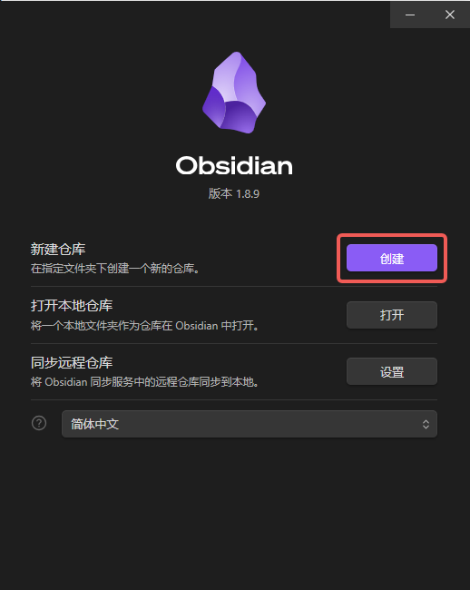

# ObsidianGitPage

使用 Obsidian + VitePress + Git 实现全流程的个人技文档或博客的撰写，同步，部署与上线。

## 功能介绍


## 工作流程

- 使用 Obsidian 在本地撰写内容
- 使用 git 将本地内容与 GitHub 仓库同步
- 使用 VitePress 获取 Markdown 内容生成个性化博客页面
- 使用 Github Actions 部署为 `https://<username>.github.io/repo` 页面

## 部署步骤

### 安装Obsidian
1. 在 [Obsidian - Sharpen your thinking](https://obsidian.md/) 选择合适的版本在本地安装Obsidian
2. 新建一个Obsidian仓库
3. 在仓库里新建一些内容，熟悉一下Obsidian的使用方法吧！
### 安装Git插件并上传 GitHub 仓库
1. 在Obsidian的仓库设置中，关闭安全模式，下载Git插件，同时ni'ye'ke
2. 安装完 Obsidian git 插件后，你还需要本地拥有 git，你需要新建一个 GitHub 仓库，假设仓库取名为 `ObsidianTest` 
3. 然后你需要把你当前的 Obsidian 仓库所在的文件夹与 GitHub 仓库关联，也就是将本地的Obsidian 文件夹上传到 GitHub仓库，注意这里的上传的文件夹应当是包含 .obsidian 的。如下，初始化 GitHub 仓库后，此时本地的文件夹至少包括如下标红内容。
4. 然后你需要在本地进行新建内容测试，确保本地新增内容能够成功的上传到对应的GitHub仓库。到此，以及完成了我们的**同步功能**！
### 安装 VitePress
1. 打开 VitePress官网安装教程 [快速开始 | VitePress](https://vitepress.dev/zh/guide/getting-started)，了解安装步骤，做好前置准备。
2. 本地使用编译器 VSCode 打开GitHub仓库所在的文件夹，上面截图所在的文件夹。
3. 在编译器终端输入 `npm add -D vitepress` 进行配置下载
4. 在编译器终端输入 `npx vitepress init` 进行初始化（3和4两步具体参照 VitePress官网安装教程），注意在初始化时，建议直接选择在根目录 `./`
5. 运行 `npm run docs:dev`，测试是否安装和初始化成功，此时你可以尝试在Obsidian新建一个test文件（默认为 .md 文件）， 然后在浏览器中访问 `http://localhost:5173/test`，初始化成功的结果如下图。
6. 目前已经在本地完成了Obsidian内容到个人文档博客的转化，如果你想要更加个性的文档博客，你可以参照 [VitePress | 由 Vite 和 Vue 驱动的静态站点生成器](https://vitepress.dev/zh/) 进行开发和配置！
### 部署与上线到GitHub Pages
这里参照 [部署 VitePress 站点 | VitePress](https://vitepress.dev/zh/guide/deploy) 中部署到GitHub Pages的方法
1. 我们站点位于项目的根目录 `./` 下
2. 在 `.vitepress/config.mts ` 中添加配置，如图
3. 在项目的文件夹下创建一个 `.github/workflows` 目录，在该目录中创建一个名为 `deploy.yml` 的文件，如图
   
4. 在 `deploy.yml` 中输入如下内容：
```yaml
# 构建 VitePress 站点并将其部署到 GitHub Pages 的示例工作流程
#
name: Deploy VitePress site to Pages

on:
  # 在针对 `main` 分支的推送上运行。如果你
  # 使用 `master` 分支作为默认分支，请将其更改为 `master`
  push:
    branches: [main]

  # 允许你从 Actions 选项卡手动运行此工作流程
  workflow_dispatch:

# 设置 GITHUB_TOKEN 的权限，以允许部署到 GitHub Pages
permissions:
  contents: read
  pages: write
  id-token: write

# 只允许同时进行一次部署，跳过正在运行和最新队列之间的运行队列
# 但是，不要取消正在进行的运行，因为我们希望允许这些生产部署完成
concurrency:
  group: pages
  cancel-in-progress: false

jobs:
  # 构建工作
  build:
    runs-on: ubuntu-latest
    steps:
      - name: Checkout
        uses: actions/checkout@v4
        with:
          fetch-depth: 0 # 如果未启用 lastUpdated，则不需要
      # - uses: pnpm/action-setup@v3 # 如果使用 pnpm，请取消此区域注释
      #   with:
      #     version: 9
      # - uses: oven-sh/setup-bun@v1 # 如果使用 Bun，请取消注释
      - name: Setup Node
        uses: actions/setup-node@v4
        with:
          node-version: 22
          cache: npm # 或 pnpm / yarn
      - name: Setup Pages
        uses: actions/configure-pages@v4
      - name: Install dependencies
        run: npm ci # 或 pnpm install / yarn install / bun install
      - name: Build with VitePress
        run: npm run docs:build # 或 pnpm docs:build / yarn docs:build / bun run docs:build
      - name: Upload artifact
        uses: actions/upload-pages-artifact@v3
        with:
          path: .vitepress/dist # 由于我们站点在根目录下，因此。vitepress也位于根目录

  # 部署工作
  deploy:
    environment:
      name: github-pages
      url: ${{ steps.deployment.outputs.page_url }}
    needs: build
    runs-on: ubuntu-latest
    name: Deploy
    steps:
      - name: Deploy to GitHub Pages
        id: deployment
        uses: actions/deploy-pages@v4
```
5. 来到 GitHub 仓库设置中的“Pages”菜单项下，选择“Build and deployment > Source > GitHub Actions”。
6. 将更改推送到 `main` 分支并等待 GitHub Action 工作流完成，你可以查看具体的部署上线过程，配置正确如图
7. 访问你部署的站点 `https://<username>.github.io/[repository]/` 或 `https://<custom-domain>/`，这取决于你的设置。根据我们之前的配置，可以看到test内容。
   